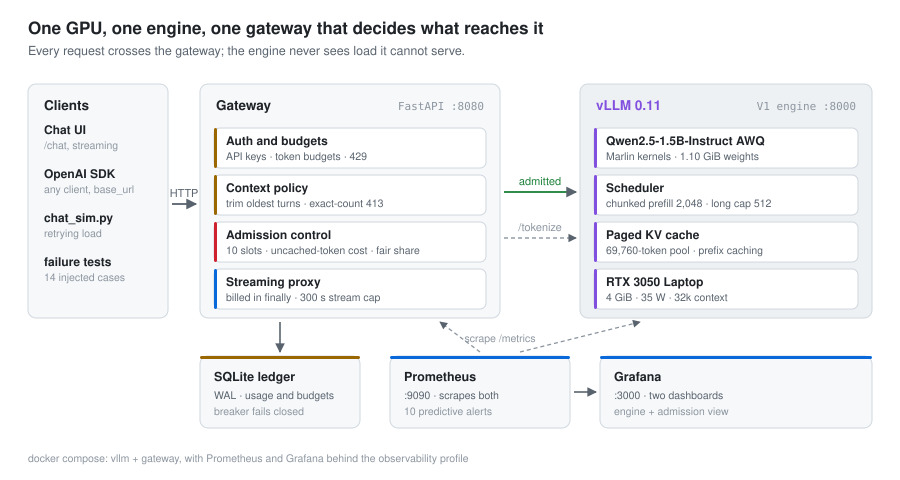

# Qwen2.5-1.5B-AWQ on vLLM on an RTX 3050 4 GB

[](https://github.com/DamnKuldeep/qwen2.5-1.5b-awq-vllm-rtx3050-4gb/actions/workflows/ci.yml)
[](LICENSE)
[](https://github.com/vllm-project/vllm)
[](https://huggingface.co/Qwen/Qwen2.5-1.5B-Instruct-AWQ)

**A production-shaped LLM chat service on a single 4 GiB laptop GPU:** vLLM
serving `Qwen2.5-1.5B-Instruct-AWQ` behind a FastAPI gateway that does
cache-aware admission control, per-tenant fairness, context and output bounds,
auth and token budgets, with Prometheus, Grafana, ten predictive alerts, a
multi-user load simulator and a 14-case failure matrix. Every number below was
measured on the machine, and every chart is generated from the result files.

| **20** | **97%** | **10** | **0** |
| :---: | :---: | :---: | :---: |
| concurrent chat users at the SLO | of messages get a first token within 1.5 s of pressing send, retries included | requests decoding on the GPU at once, enforced by the gateway | errors across every load test; overload is refused with `Retry-After` |

<picture>
  <source media="(prefers-color-scheme: dark)" srcset="docs/img/degradation-dark.svg">
  
</picture>

Heat-soaked card, seeded Poisson arrivals, 12 s mean think time, conversations
that grow every turn, and clients that retry a `503` the way the OpenAI SDK
does. The metric is **SLO attainment**: a message counts only if its first token
arrived within 1.5 s of the *first* send, so every refusal and retry counts
against it. Full tables: **[docs/RESULTS.md](docs/RESULTS.md)**.

---

## Architecture

<picture>
  <source media="(prefers-color-scheme: dark)" srcset="docs/img/architecture-dark.svg">
  
</picture>

**The gateway is the only limiter.** vLLM's own `--max-num-seqs` is 32, far
above the gateway's 10, so the engine never queues work the gateway believes it
controls: the engine's `waiting` gauge stayed at 0 through the whole evidence session. Policy,
refusals and metrics live in one place.

## A request's path

<picture>
  <source media="(prefers-color-scheme: dark)" srcset="docs/img/request-lifecycle-dark.svg">
  
</picture>

Every gate refuses cheaply and specifically. A `429` costs ~8 ms against
~5,000 ms to serve. A `413` is decided on the engine's exact token count from
vLLM's `/tokenize` (CPU only) and never reaches the GPU. A `503` carries
`Retry-After`, and its reason (`queue_timeout`, `queue_full`, `per_key_limit`)
is both a header and a metric label.

---

## Engineering decisions

Each setting was chosen by measurement on this card. The ablations behind them
are in [RESULTS §5](docs/RESULTS.md#5-ablations-behind-the-shipped-configuration).

| Decision | Why | Measured |
| --- | --- | --- |
| **Qwen2.5-1.5B, AWQ with Marlin kernels** | 1.10 GiB of weights leaves a 69,760-token KV pool on a 4 GiB card | 4.3x the SLO-compliant throughput of the 3B-AWQ; decode scales with weight bytes, prefill with parameters, both predicted within 3% |
| **32,768-token window** | `--max-model-len` is a ceiling, not an allocation: KV blocks are paged 16 tokens at a time | Identical KV pool at 4k and 32k |
| **Shared system prompt + prefix caching** | Every conversation reuses the same leading blocks, and each turn reuses its own history | 2x concurrency and −82% TTFT at the SLO; hit rate 63–95% in every run |
| **Chunked prefill, `--long-prefill-token-threshold 512`** | The V1 scheduler serves running requests first, so a long prefill would take the whole 2,048-token step | Short requests behind a 20k-token prompt: **0.4 s** with the cap, 11–13 s without |
| **10 requests in flight** | Measured on chat, where most prefill is a cache hit (a cold-prompt ramp holds only 6) | 20 users at 97% in the evidence run (87–99% across every run at this setting); 8 and 10 slots tie at the GPU's ~300 tok/s plateau |
| **Admission cost on uncached tokens** | A slot should buy GPU work, and cached history costs almost none | `1 + uncached/2,048` slots: a cached turn costs 1, a cold 20k prompt costs 8 of 10 |
| **Dynamic per-key share** | `ceil(10 / contending keys)`, capped at half the pool | One key at 50 concurrent: normal users keep **94%** attainment, 96.9% of its requests refused |
| **1.0 s queue, then `503` + `Retry-After`** | A refusal costs the user ≥2 s, so a short wait beats it; a long wait breaks the SLO for admitted work | Best of 0.6 / 1.0 / 2.0 s at 40 users; 2.0 s pushed admitted p95 past 1.5 s |
| **Output bound: default 1,024, ceiling 2,048** | vLLM defaults an absent `max_tokens` to the rest of the window, ~30k tokens | Slot hold time is finite; clamps reported in `X-Max-Tokens-Clamped-From` |
| **Context trimming + exact-count `413`** | Drop the oldest turns to fit; refuse only what can never fit | 95k-token conversation → 27 turns dropped → `200`; an oversized message → `413`, engine never called |
| **Billing circuit breaker** | GPU work that cannot be billed must stop | Ledger unwritable: 3 unbilled requests, then `503`, then automatic recovery |

<details>
<summary><b>How many requests run on the GPU, and what happens as context grows</b></summary>

<picture>
  <source media="(prefers-color-scheme: dark)" srcset="docs/img/concurrency-dark.svg">
  
</picture>

At most ten at once, fewer when prompts are long and cold. Inside that cap the
batch is fully dynamic: continuous batching recomposes it every scheduler step.

| Scale | Mechanism | Measured |
| --- | --- | --- |
| Within one reply | KV blocks allocated on demand; if the pool fills, V1 **preempts** by recompute (no CPU swap in V1) | **0 preemptions in every run.** KV peaked at ~57% during twenty simultaneous cold 8k-token openings; chat sits at 5–20% |
| Between turns | History stays in the prefix cache, evicted LRU; the next turn reuses the longest cached prefix, and a miss costs ~9x | Hit rate **63–95%**; it dips only when many conversations open cold at once |
| At the window | The gateway drops the oldest non-system turns and reports them in `X-Context-Trimmed-Messages` | 95k tokens sent → 9.7k reached the engine → `200` |

</details>

<details>
<summary><b>The operating envelope: what "20 users" assumes</b></summary>

| Dimension | Where 20 holds | Outside it |
| --- | --- | --- |
| Think time | 12 s mean, log-normal | Scales with duty cycle: ~40 users at 30 s, ~55 at 45 s (extrapolated) |
| Reply length | 192 tokens, ~4 s of decode | 512 → ~11 users; 1,024 → ~8; 2,048 → ~6. The strongest lever after concurrency |
| Conversation length | Openings of 300–2,000 tokens, growing each turn | Twenty users each pasting 8k tokens of context: 27%. Twenty cold, quadratic prefills are close to a minute of GPU time |
| Prompt size | Anything that fits 32,768 tokens | A 20k prompt costs 8 slots and ~12 s of prefill, without blocking anyone else |
| No EOS | Generation runs to `max_tokens`; the chat UI auto-continues up to 3 times | No priority scheme: a slot is held for the whole stream, which is why output is bounded |
| Thermal state | Heat-soaked at 85–87 °C | A cold card runs up to ~40% faster for its first two minutes |
| SLO | First token < 1.5 s from first send, retries and queue wait included | Not end-to-end latency. Once streaming starts, ITL is ~20 ms/token at 10 concurrent |

Throughput depends on the shape it was measured in: **182 tok/s** at 20 users
within the SLO; a **~300 tok/s** plateau when saturated; **686 tok/s** peak
with the SLO abandoned (16 concurrent, 471 in / 512 out); 59–89 tok/s for a
single stream. Derivation in [docs/CAPACITY_MODEL.md](docs/CAPACITY_MODEL.md).

</details>

---

## Results

| offered load | messages within 1.5 s | served first try | admitted p95 TTFT |
| ---: | ---: | ---: | ---: |
| 10 users | **100%** | 100% | 854 ms |
| **20 users** | **97%** | 97% | 840 ms |
| 25 users | 67% / 78% (two runs) | 71% / 81% | 1.3–1.4 s |
| 40 users | 35% / 61% (two runs) | 41% / 61% | 1.1–1.6 s |
| 60 users | 24% | 27% | 2.2 s |

- **Traffic shapes:** a slow diurnal cycle peaking at 40 users keeps 87%;
  bursts and a thundering herd far past capacity are refused cleanly, with
  admitted p95 held at 1.2–3.2 s and nothing erroring.
- **Fairness:** one key at 50 concurrent requests cannot take more than its
  share; the other users keep 94% attainment.
- **Past the knee, runs disagree** (25 users: 67% and 78%). Refused users
  return 2–3 s later, so saturated load feeds on itself. Below the knee the
  control run reproduces exactly.

Everything, including conversation lengths and every ablation arm, is in
**[docs/RESULTS.md](docs/RESULTS.md)**, generated from
[`load_testing/results/`](load_testing/results).

## Reliability

Fourteen failure cases, each with the behaviour **expected before testing**
next to the behaviour measured: [docs/FAILURE_MATRIX.md](docs/FAILURE_MATRIX.md).

| Failure | Measured |
| --- | --- |
| Engine crashes mid-stream | Detected in 1.2 s, back in 79 s. Gateway `/health` stayed 200, `/ready` went 503 → 200. **156 of 156 requests billed, drift 0** |
| Gateway restarts under load | Back in 4.8 s; in-flight requests fail cleanly, budgets intact |
| Burst of 100 at once (10x the limit) | 12 served at p95 1.4 s, 88 refused with `Retry-After` |
| A 20k-token prompt among chat traffic | Short requests keep flowing at 0.6 s |
| Client disconnects, or reads one chunk a second | Slot released; usage still recorded; others unaffected |
| Billing ledger unwritable | Fails closed after 3 unbilled requests, recovers on its own |

Every case passes except one documented limitation: thermal throttling is
detected by `benchmarks/watch_gpu.ps1` but is not alertable from Prometheus
under WSL2.

## Observability

Failures on a GPU service are mostly silent: a host power setting once cost
11.6x throughput with no error anywhere, and a prefix-cache miss costs 9x and
prints nothing. So the dashboards and ten alert rules watch **what predicts
failure**: prefix-cache hit rate, queue depth, client-observed TTFT including
queue time, refusals by reason, KV usage and preemptions, billing write
failures, and throughput below the thermal floor.

<picture>
  <source media="(prefers-color-scheme: dark)" srcset="docs/img/session-dark.svg">
  
</picture>

<details>
<summary><b>Grafana: gateway admission and capacity</b></summary>

<picture>
  <source media="(prefers-color-scheme: dark)" srcset="docs/img/grafana-capacity-session-dark.png">
  
</picture>
</details>

<details>
<summary><b>Grafana: vLLM engine metrics</b></summary>

<picture>
  <source media="(prefers-color-scheme: dark)" srcset="docs/img/grafana-engine-session-dark.png">
  
</picture>
</details>

---

## Quickstart

**You need** an NVIDIA GPU with ≥ 4 GiB VRAM, a driver providing **CUDA ≥ 12.8**,
and Docker with GPU passthrough (Docker Desktop with the WSL2 backend on
Windows; the NVIDIA Container Toolkit on Linux).

```powershell
git clone https://github.com/DamnKuldeep/qwen2.5-1.5b-awq-vllm-rtx3050-4gb.git
cd qwen2.5-1.5b-awq-vllm-rtx3050-4gb/deployment/docker

docker volume create hf-cache      # model cache survives `compose down`

$env:COMPOSE_FILE="docker-compose.yml;docker-compose.1_5b-awq.yml"     # PowerShell
# export COMPOSE_FILE="docker-compose.yml:docker-compose.1_5b-awq.yml"  # bash

docker compose --profile observability up -d
docker compose ps                  # wait until vllm reads "healthy" (60–90 s)
```

The first launch pulls the vLLM image (~10 GB), downloads the model (~1.2 GB)
and compiles kernels (~60 s). Stop with `docker compose --profile observability
down`; the model cache and usage ledger survive.

| URL | What it is |
| --- | --- |
| <http://localhost:8080/chat> | Chat UI (API key `dev-key-alpha`) |
| <http://localhost:8080/dashboard?key=dev-key-alpha> | Usage, budgets and request history per key |
| <http://localhost:8080/admission> | Live admission state |
| <http://localhost:3000> | Grafana: engine and capacity dashboards |
| <http://localhost:9090/alerts> | The ten alert rules |

Any OpenAI client works:

```python
from openai import OpenAI
client = OpenAI(base_url="http://localhost:8080/v1", api_key="dev-key-alpha")
```

> **On a laptop, check `nvidia-smi` for `P8` under load.** Windows' default GPU
> power policy can hold the card at idle clocks during decode, an 11.6x loss.
> NVIDIA Control Panel → Power management mode → *Prefer maximum performance*.

Everything is pinned: `vllm/vllm-openai:v0.11.0`, model revision
`3ecffa0ceb27851800f45519bab9c457a04405e1`.

## Reproduce and test

```powershell
.\benchmarks\run_evidence_suite.ps1        # ~50 min: capacity sweep + control, traffic shapes,
                                          # conversation lengths, fairness, dashboard capture,
                                          # failure matrix, crash and restart tests
.\benchmarks\ablate_long_prefill.ps1       # scheduler threshold ablation
.\benchmarks\ablate_gateway.ps1 ...        # one gateway setting at a time (usage in its header)
python benchmarks/build_results_page.py    # regenerate docs/RESULTS.md
python docs/img/_gen_diagrams.py           # regenerate the diagrams

pytest                                     # 42 gateway tests, no GPU needed (what CI runs)
node ui/test_markdown.mjs                  # 25 chat-renderer tests, including XSS
```

Every run is heat-soaked first, uses a fixed seed, embeds the engine config
that produced it, and ends with a control run: on this card, thermal state
alone moves an identical run's throughput by 42%. The ten measurement rules,
each traced to the failure that produced it, are in
[benchmarks/optimization_results.md](benchmarks/optimization_results.md).

---

## Findings

**1. Measure latency from the user's side.** At 25 users the p95 of *admitted*
requests is 1.4 s, inside the SLO, while users actually waited 7.8 s at p95,
because refused messages wait for `Retry-After` and try again. Every gateway
setting here was tuned on SLO attainment from first send.

**2. A concurrency limit is only as good as the workload it was measured on.**
A ramp of cold 512-token prompts holds 6 requests inside the SLO; chat, which
resends history the prefix cache already holds, holds 10.

**3. Decode is core-clock-gated, not memory-bandwidth-bound.** Memory clock
stayed pinned at 5,501 MHz while inter-token latency swung 56%, tracking SM
clock within 6%. On this card, cooling buys more throughput than bandwidth.

**4. Prefill is quadratic.** `TTFT ≈ 0.13 + n/3070 + n²·1.11e-8` fits the
measurements within 5%. Attention is 1.6% of prefill at 471 tokens and 43% at
22,586; a full 32k prompt costs ~23 s.

**5. The binding constraint depends on how people use the product.** At 12 s
think time admission binds at ~20 users and the prefix cache would not bind
until ~70. With 45 s think time and 4k-token conversations, the cache binds
first at ~17.

The prediction log, **twenty-four predictions written down before measuring
and then contradicted**, is in
[docs/FINAL_REPORT.md §11](docs/FINAL_REPORT.md#11-what-this-project-got-wrong-and-what-that-taught).

## Limitations

* **The knee is sharp, and past it results vary run to run** (40 users: 35%
  and 61% with identical settings), because retries feed saturated load.
* **Long pasted contexts are bounded by prefill physics.** Twenty users each
  opening with ~8k tokens reach 27% attainment.
* **Answer quality is measured on one control question only.**
* **Single replica.** SQLite has one writer; budgets across gateway replicas
  would need Postgres or Redis with atomic decrements.
* **Thermal throttling is not alertable** from Prometheus under WSL2; a proxy
  rule (throughput below floor with a busy queue) stands in, labelled as one.
* **`--gpu-memory-utilization` is 0.78**, below vLLM's 0.9, because Windows
  WDDM reserves VRAM the engine cannot use.
* **One 502 was observed** after an idle gap, consistent with a keep-alive
  race (vLLM and httpx both default to 5 s). The gateway expires idle upstream
  connections at 2 s; the race did not reproduce on demand.
* **The numbers do not transfer.** This characterises one stack on one 35 W
  laptop GPU, together with the derivation of why it behaves as it does.
* **Not measured:** speculative decoding, multi-replica serving, real user traffic.

---

## Repository

| Path | Contents |
| --- | --- |
| [`gateway/`](gateway) | FastAPI service: auth, budgets, context policy, output bound, streaming proxy, usage dashboard |
| [`gateway/admission.py`](gateway/admission.py) | Bounded concurrency with cost-weighted slots, dynamic per-key share, metrics |
| [`gateway/prefix_tracker.py`](gateway/prefix_tracker.py) | Estimates what the engine's prefix cache holds, so admission charges only uncached work |
| [`gateway/context.py`](gateway/context.py) | Context-window policy and the exact-count `413` guard |
| [`deployment/docker/`](deployment/docker) | Compose stack; every flag carries its derivation in a comment |
| [`observability/`](observability) | Prometheus config, ten alert rules, two Grafana dashboards |
| [`load_testing/`](load_testing) | Chat simulator with SDK-style retries, failure matrix, crash tests, every result file |
| [`benchmarks/`](benchmarks) | Evidence suite, ablations, dashboard capture, results-page generator, measurement protocol |
| [`ui/`](ui) | Chat UI with no framework or build step, and its renderer tests |
| [`docs/`](docs) | [Results](docs/RESULTS.md) · [Capacity model](docs/CAPACITY_MODEL.md) · [Failure matrix](docs/FAILURE_MATRIX.md) · [Final report](docs/FINAL_REPORT.md) · [Concepts](docs/CONCEPTS_EXPLAINED.md) · [Map of all docs](docs/README.md) |

Design reasoning is recorded in [DECISIONS.md](DECISIONS.md) and the full
build history in [PROGRESS_LOG.md](PROGRESS_LOG.md). Built stage by stage as a
learning project, with an AI assistant explaining each piece and the human
running every command; `CLAUDE.md`, `PRODUCT_SPEC.md` and `PROJECT_PLAN.md`
are the working agreement that produced it.
