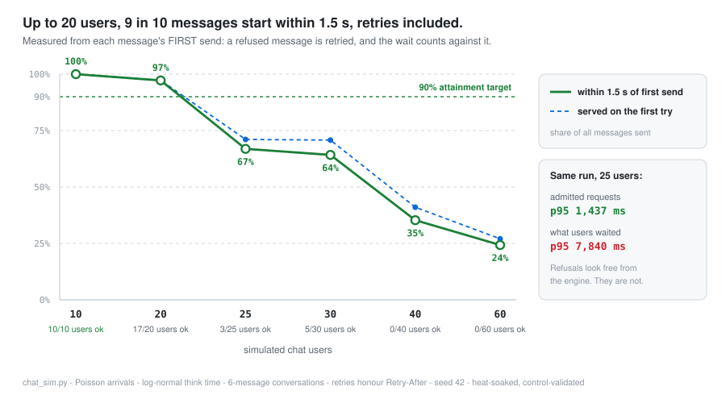
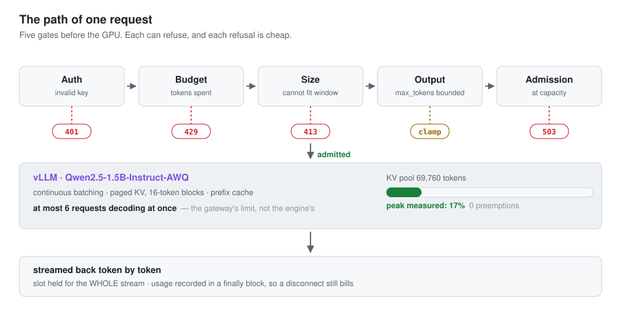
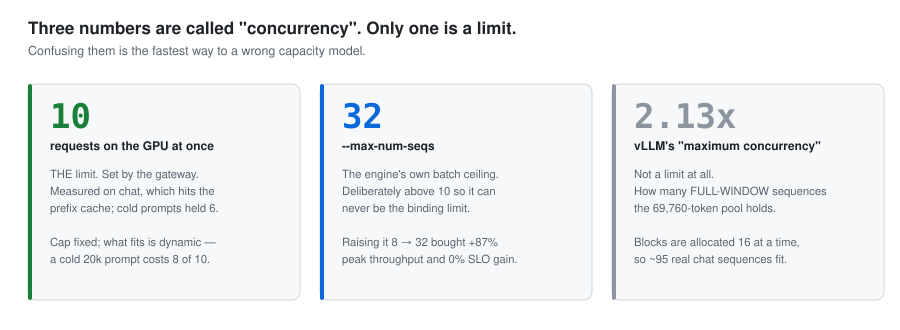
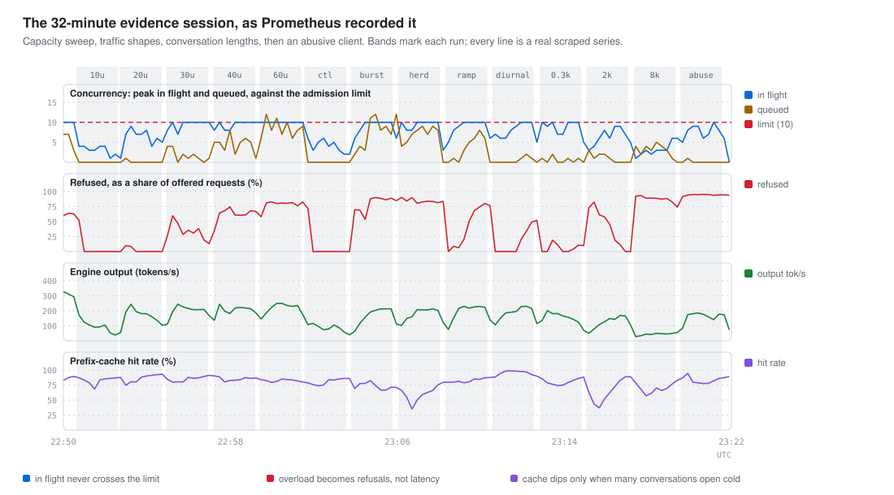
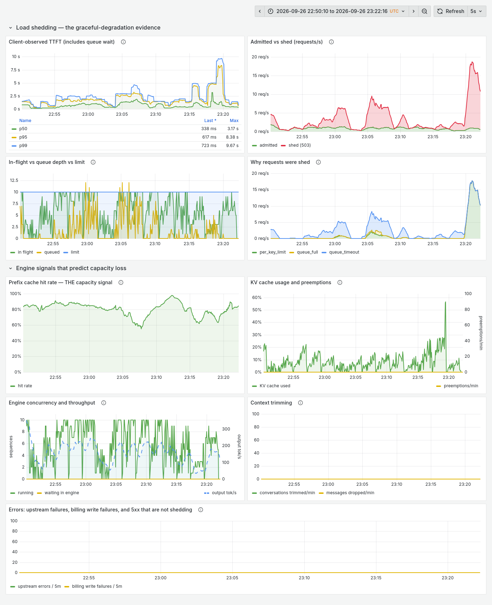
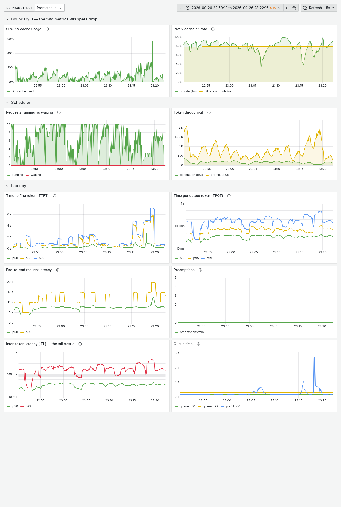

# Qwen2.5-1.5B-AWQ on vLLM on an RTX 3050 4 GB

[](https://github.com/DamnKuldeep/qwen2.5-1.5b-awq-vllm-rtx3050-4gb/actions/workflows/ci.yml)
[](LICENSE)
[](https://github.com/vllm-project/vllm)
[](https://huggingface.co/Qwen/Qwen2.5-1.5B-Instruct-AWQ)

**Serving an LLM to many people at once from a single 4 GiB laptop GPU —
finding the hardware's real ceiling, building a gateway that refuses to exceed
it, and recording every prediction that turned out wrong.**

vLLM serving `Qwen2.5-1.5B-Instruct-AWQ` behind a FastAPI gateway that does
cache-aware admission control, per-tenant fairness, output bounding, context
management, auth and token budgets, with Prometheus, Grafana, ten predictive
alert rules, a multi-user load simulator whose clients retry like real ones,
and a 14-case failure matrix.

The hardware is an **NVIDIA RTX 3050 Laptop GPU, 4096 MiB VRAM, 35 W**, which
thermally throttles from ~1,500 MHz to ~950–1,200 MHz sustained. The
constraints are severe enough that nothing could be assumed, so everything was
measured — and most of the interesting numbers contradicted a prediction that
had been written down first.

---

## The headline

> **20 people chatting at once, and 97% of their messages get a first token
> within 1.5 s of pressing send, with refusals and retries included.** Past that
> the knee is sharp (25 users: 67–78%), and the service degrades by refusing
> work with `Retry-After`, never by erroring: 0 errors across every run.

| offered load | messages with a first token < 1.5 s | served on the first try | admitted p95 TTFT |
| ---: | ---: | ---: | ---: |
| 10 users | **100%** | 100% | 854 ms |
| **20 users** | **97%** | 97% | 840 ms |
| 25 users | 67% / 78% (two runs) | 71% / 81% | 1.3–1.4 s |
| 40 users | 35% / 61% (two runs) | 41% / 61% | 1.1–1.6 s |
| 60 users | 24% | 27% | 2.2 s |

Heat-soaked card, seeded Poisson arrivals, 12 s mean think time, conversations
that grow every turn, and **clients that retry a 503 the way the OpenAI SDK
does**. Every number is generated from the result files:
**[docs/RESULTS.md](docs/RESULTS.md)**.

<picture>
  <source media="(prefers-color-scheme: dark)" srcset="docs/img/degradation-dark.svg">
  
</picture>

## Refusals are not free, and this repository used to pretend they were

The first version of this README said **"not one user breached the SLO at any
load, from 10 users to 60."** That was true of the requests the gateway
*admitted*, which is the engine's view, and it is how most serving benchmarks
report. It hid the refused ones. Judged by admitted latency alone, refusing
everyone scores perfectly.

Two bugs made it look better than it was:

* **The load simulator never retried.** A refused message was dropped and the
  user moved on to a follow-up. When that message was the opening of a long
  conversation, the whole long context silently vanished, so **a run that
  refused more carried a lighter workload.** Two arms of one ablation ended up
  20% apart in mean prompt size for exactly this reason.
* **A refusal costs the user at least the `Retry-After` wait.** A message
  refused once has already missed a 1.5 s target, whatever happens next.

Re-measured from the user's side (**SLO attainment**: the share of messages
whose first token arrived within 1.5 s of the *first* send), the gateway was
tuned again, and three settings moved:

| setting | tuned from the engine's side | tuned from the user's side | why |
| --- | ---: | ---: | --- |
| requests in flight | 6 | **10** | 6 came from a benchmark where every request is a cold prefill. Chat hits the prefix cache 63–95% of the time, and the engine holds 10 with admitted latency no worse. Paired back-to-back runs, 20 users: 85–92% → **99%** (a gap about the size of run-to-run noise, see [RESULTS §5b](docs/RESULTS.md#5b-tuning-the-gateway-from-the-users-side)) |
| queue timeout | 0.6 s | **1.0 s** | 0.6 s was "SLO minus engine TTFT", which treats a refusal as free. At 40 users: 35% → **51%** attainment; 2.0 s pushed admitted p95 past the SLO |
| admission cost of a long prompt | full length | **uncached part** | Every turn of an 8k-token conversation was charged as a cold 8k prefill (4 of 6 slots) while the engine served ~90% of it from cache |

---

## How a request flows

<picture>
  <source media="(prefers-color-scheme: dark)" srcset="docs/img/request-lifecycle-dark.svg">
  
</picture>

**The gateway is the only limiter.** `--max-num-seqs` is set to 32, far above
the gateway's 10, so the engine's own cap can never silently shape traffic the
gateway believes it is controlling. One limiter, where the policy and the
metrics live.

Every refusal is cheap and specific. A `429` costs ~8 ms against ~5,000 ms to
serve. A `413` never reaches the GPU: it is decided on the engine's exact token
count from vLLM's `/tokenize` (CPU only), because a character estimate refused
a prompt that fit. A `503` carries `Retry-After` so a client can back off
rather than guess.

---

## The envelope — what "20 users" actually bounds

Every capacity number has a shape it was measured in. This is the shape, and
what happens outside it.

| Dimension | Where 20 holds | Outside it |
| --- | --- | --- |
| **Concurrency** | 10 requests in flight at the engine, the gateway's limit | The engine's own `--max-num-seqs` is 32, deliberately above this, so it never binds first |
| **Think time** | 12 s mean (log-normal). Real users often think longer | Scales with duty cycle: ~40 users at 30 s, ~55 at 45 s (extrapolated from the measured anchor) |
| **Output per turn** | 192 tokens (~4 s of decode) | 512 tokens → ~11 users; 1,024 → ~8; 2,048 → ~6. **Reply length is the strongest lever after concurrency** |
| **Conversation length** | Mixed openings of 300–2,000 tokens, growing each turn | Twenty users *each opening* with a pasted 2k context: 60% attainment. With 8k: 27%. Twenty cold 8k prefills are close to a minute of GPU time on their own |
| **Prompt size per request** | Anything that fits the window | A 20k-token prompt no longer blocks anyone: short requests behind it wait 0.4–0.6 s (was 11–13 s), thanks to `--long-prefill-token-threshold 512` |
| **Context window** | 32,768 tokens, hard (`rope_scaling: null`). Costs zero KV cache vs 4k: measured | Oldest turns dropped, reported in `X-Context-Trimmed-Messages`. A single message too big to fit gets a **413** rather than the engine's 400 |
| **Max output per call** | Gateway default **1,024** if the client sends none; **ceiling 2,048** (clamped, reported in a header) | Without this, vLLM defaults an absent `max_tokens` to *the rest of the window*: ~30k tokens, holding a slot for minutes |
| **No EOS emitted** | Generation runs to `max_tokens`, `finish_reason: "length"`. The chat UI auto-continues up to 3 times | There is no priority scheme. Continuous batching gives every running sequence one token per step; a slot is held for the *whole* stream. That is why the output bound exists |
| **Stream duration** | Bounded at 300 s; slot released after | A client reading one byte per second cannot hold capacity |
| **Thermal state** | All numbers taken heat-soaked at 85–87 °C | A cold card runs up to ~40% faster for the first two minutes. Compare only runs from the same thermal state |
| **SLO definition** | First token < 1.5 s **from the message's first send**, retries and queue wait included | Not end-to-end latency. Once streaming starts, ITL is ~20 ms/token at 10 concurrent |

Full derivation, including why simple duty-cycle arithmetic overestimated
capacity, in **[docs/CAPACITY_MODEL.md](docs/CAPACITY_MODEL.md)**.
## Three numbers are called "concurrency". Only one is a limit.

<picture>
  <source media="(prefers-color-scheme: dark)" srcset="docs/img/concurrency-dark.svg">
  
</picture>

**So how many requests are actually processed on the GPU at once? Ten, at
most.** Fewer when prompts are cold and long: a request costs
`1 + uncached_tokens / 2,048` slots, so a cold 20k-token prompt takes 8 of the
10, while the next turn of the same conversation, served from the prefix
cache, costs 1. Measured `peak_inflight` in every loaded run: 10, and the
engine's `num_requests_running` tracks it exactly (the Grafana capture below
shows both).

Inside that cap the batch is fully dynamic: continuous batching recomposes it
every scheduler step as sequences finish and new ones are admitted.

**What happens as context grows**, three mechanisms at three scales, all measured:

| Scale | Mechanism | Measured |
| --- | --- | --- |
| Within one reply | KV blocks allocated on demand, 16 tokens at a time. If the 69,760-token pool fills, vLLM **preempts**: evicts a running sequence's blocks and re-prefills it later (V1 preempts by recompute; there is no CPU swap in V1) | **0 preemptions in every run.** KV peaked at ~57%, during twenty simultaneous cold 8k-token openings; ordinary chat sits at 5–20% |
| Between turns | The conversation's history sits in the prefix cache as free blocks, evicted LRU. On the next turn vLLM reuses the longest cached prefix; a miss re-prefills everything at ~9x the cost | Hit rate **63–95%** across every run. It dips only when many conversations open cold at once (thundering herd) |
| At the window | Past 32,768 tokens the **gateway** drops the oldest non-system turns and reports it in `X-Context-Trimmed-Messages`. A *single* message too large to fit is refused with **413** before it costs a slot, since trimming never drops the current question | 95k tokens across many turns → 27 dropped → **200**. One oversized message → **413**, engine never called |

**Best and worst, with the shape each was measured in** (throughput means
nothing without input and output lengths):

| | Concurrency on GPU | Throughput | Shape / condition |
| --- | ---: | ---: | --- |
| **Best, SLO abandoned** | 16 | **686 tok/s** | 471 in / 512 out, `--max-num-seqs 32`, not heat-soaked |
| **Saturated chat** | 10 | **~230–310 tok/s** | 40 users, 192-token replies, heat-soaked. The plateau is the GPU: 8 and 10 slots tie |
| **Chat at the SLO** | ≤10 | 182 tok/s | 20 users, 97% attainment |
| Single stream | 1 | 59–89 tok/s | 471 in / 256 out; the spread is thermal |
| One giant prompt in flight | 10 | others keep flowing | Short requests behind a 20k-token prefill wait 0.4–0.6 s |
| **Pathological** | any | **4.15 tok/s** | Windows GPU power policy holding the card in P8. Silent. 11.6x recovered by one setting |

---

## What each decision bought

The inference-engineering story as before/after numbers. Every row is a
measurement on this hardware, roughly in the order it happened.

| Decision | Before | After | Bought |
| --- | ---: | ---: | --- |
| **Host GPU power mode** → *Prefer maximum performance* | 4.15 tok/s, card stuck in P8 | 47.99 tok/s, P0 | **11.6x**, zero code. Silent: no engine metric showed it |
| **Model: 3B-AWQ → 1.5B-AWQ** | SLO holds to conc 2 @ 64.7 tok/s; 28k-token KV | conc 6 @ 295–332 tok/s; 69,760-token KV | **4.3x SLO-compliant throughput**, 2.4x KV cache. Decode ∝ weight bytes (−38%), prefill ∝ params (−51%), both predicted within 3% |
| **Shared system prompt** (prefix cache) | SLO fails at conc 4 | holds at conc 8 | **2x concurrency, TTFT −82%**, KV usage halved |
| **`--max-model-len` 4,096 → 32,768** | 4k window | 32k window | **Zero KV cost**: 69,616 tokens at both. A ceiling, not an allocation |
| **`--max-num-seqs` 8 → 32** | peak 367 tok/s | peak 686 tok/s | +87% peak, **0% SLO gain**, but the engine can no longer be a hidden limiter |
| **Admission control** | TTFT 13 s and rising under overload | bounded | Unbounded → bounded |
| **Per-key share: fixed → dynamic** | one abuser takes 50%, 10/10 users over SLO | normal users keep 94% attainment; 96.9% of abuse refused | Fairness that survives a real attacker |
| **`--long-prefill-token-threshold 512`** | short requests wait 11–13 s behind one 20k prompt | 0.4–0.6 s | Head-of-line blocking, written off as unfixable on this build, fixed by one flag used *alone*. Ordinary chat stayed within run-to-run noise |
| **Admission limit 6 → 10**, measured on chat not cold prompts | 20-user attainment 85–92% | **99%** (paired runs) | The ramp's ceiling was for cold prefills; chat is mostly cache hits. Admitted latency no worse |
| **Queue timeout 0.6 → 1.0 s**, tuned with retrying clients | 40-user attainment 35% | 51% | A refusal costs ≥2 s; a slightly longer wait is cheaper |
| **Admission cost on the uncached part** | every turn of an 8k conversation cost 4 of 6 slots | cached turns cost 1 | Long conversations are no longer refused for work the engine does not do |
| **413 on the exact token count** | a 20k prompt that fits was refused (8.3 chars/token, estimate assumed 4.5) | refused only when it really cannot fit | No false refusals the client cannot fix |
| **Context trim policy** | hard 400 past 32k | 200 + trim header | Long conversations never crash |
| **Billing circuit breaker** | serves unbilled work indefinitely if the ledger fails | 3 unbilled, then 503, auto-recovers | Fails closed |
| **Output bound** (default 1,024 / cap 2,048) | absent `max_tokens` → ~30k-token hold | bounded ~40 s worst case | Slot hold time is finite |
| **Measurement protocol** (heat-soak, nonce, control run, retrying clients) | 42% swings between identical runs; refusals invisible | controls reproduce; refusals counted | The numbers above mean something |

---

## What watches it

Failures on a GPU service are mostly silent: the 11.6x power-state loss had no
error in any log, and a prefix-cache miss costs 9x and prints nothing. So the
observability is built around **what predicts failure, not what reports it**.

| Signal | Why it is predictive | Source |
| --- | --- | --- |
| **Prefix cache hit rate** | Falls *before* latency rises, because spare capacity absorbs the extra prefill first | vLLM `/metrics`, scraped directly |
| **Admission queue depth** | A request has to wait before it can be slow | gateway `/metrics` |
| **KV cache %** and **preemptions** | 5–20% is normal chat here; a sustained climb means the workload changed shape | vLLM |
| **Client-observed TTFT histogram** | Includes queue time, which the engine cannot see | gateway |
| **Billing write failures** | Non-zero means GPU work is being served unbilled | gateway |
| **Refusals by reason** | `queue_timeout`, `queue_full` and `per_key_limit` are different problems with different fixes | gateway |
| **Sustained throughput below floor with a busy queue** | The only software-visible symptom of thermal throttling, stated as a proxy because WSL2 gives Prometheus no GPU telemetry | vLLM + gateway |

Ten alert rules in [`observability/prometheus/alerts.yml`](observability/prometheus/alerts.yml),
each with the measurement its threshold came from. Two Grafana dashboards:
the engine's own metrics, and the gateway's admission view.

**The whole evidence session, as the dashboards saw it.** Real renders, not
mockups: in-flight touches the limit of 10 and never crosses it, the engine's
`running` tracks it exactly, preemptions stay at zero, and the error panel is
flat because refusals are not errors.

<picture>
  <source media="(prefers-color-scheme: dark)" srcset="docs/img/session-dark.svg">
  
</picture>

<details>
<summary><b>Grafana: gateway admission and capacity</b> (click)</summary>

<picture>
  <source media="(prefers-color-scheme: dark)" srcset="docs/img/grafana-capacity-session-dark.png">
  
</picture>
</details>

<details>
<summary><b>Grafana: vLLM engine metrics</b> (click)</summary>

<picture>
  <source media="(prefers-color-scheme: dark)" srcset="docs/img/grafana-engine-session-dark.png">
  
</picture>
</details>

**And when something does break**: the 14-case
[failure matrix](docs/FAILURE_MATRIX.md), each case with the behaviour
*expected before testing* next to the behaviour measured:

| Case | Measured |
| --- | --- |
| Engine crashes mid-stream | Detected in 1.2 s, auto-recovered in 79 s. Gateway `/health` stayed 200 throughout (never restarted), `/ready` went 503→200. **156 of 156 requests in the ledger, drift 0** |
| Gateway restarts under load | Back in 4.8 s; in-flight requests fail with a dropped connection, budgets intact |
| Client disconnects mid-stream | Slot released, usage recorded, from the generator's `finally` |
| Billing database unwritable | `200, 200, 200, 503…`: three unbilled, then closed, then auto-recovered |
| One key at 50 concurrent | Normal users keep **94%** of messages inside the SLO; 2,014 of 2,079 abusive requests refused |
| Burst of 100 simultaneous (10x limit) | 12 served at p95 1,441 ms, 88 refused with `Retry-After` |
| Conversation exceeds 32k | 95k tokens sent → 27 oldest messages dropped → engine saw 9.7k. HTTP 200 |
| A single 20k-token prompt | Short requests keep flowing at **0.6 s** while it prefills. This was the one failing case for most of the project |

14 pass, 1 documented limitation (thermal throttling is not alertable from Prometheus), 0 unexplained.

---

## Quickstart

**You need:** an NVIDIA GPU with ≥ 4 GiB VRAM and a driver providing **CUDA ≥ 12.8**
(the vLLM image refuses to start below that — checked before any of your code
runs), and Docker with GPU passthrough. On Windows that is Docker Desktop with
the WSL2 backend; on Linux, the NVIDIA Container Toolkit.

```powershell
git clone https://github.com/DamnKuldeep/qwen2.5-1.5b-awq-vllm-rtx3050-4gb.git
cd qwen2.5-1.5b-awq-vllm-rtx3050-4gb/deployment/docker

# The model cache is an external volume so `compose down` can never delete it.
docker volume create hf-cache

# Both files, always. The base file alone runs the older 3B model.
$env:COMPOSE_FILE="docker-compose.yml;docker-compose.1_5b-awq.yml"     # PowerShell
# export COMPOSE_FILE="docker-compose.yml:docker-compose.1_5b-awq.yml"  # bash

docker compose --profile observability up -d
docker compose ps          # wait until vllm reads "healthy"
```

**First launch is slow and that is normal:** it pulls the vLLM image (~10 GB),
downloads the model (~1.2 GB), and compiles kernels (~60 s). Subsequent starts
take 60–90 s. `docker compose up -d` returns in about six seconds — that is not
the engine being ready. Wait for `healthy`.

| URL | What it is |
| --- | --- |
| <http://localhost:8080/chat> | Chat UI. API key `dev-key-alpha` |
| <http://localhost:8080/dashboard?key=dev-key-alpha> | Per-key usage, budgets, request history |
| <http://localhost:8080/metrics> | Gateway metrics: queue depth, shedding, client TTFT |
| <http://localhost:8080/admission> | Live admission state, human-readable |
| <http://localhost:3000> | Grafana — engine dashboard + capacity dashboard |
| <http://localhost:9090/alerts> | 10 alert rules |
| <http://localhost:8000/metrics> | vLLM's own metrics, scraped directly |

Any OpenAI client works by changing the base URL:

```python
from openai import OpenAI
client = OpenAI(base_url="http://localhost:8080/v1", api_key="dev-key-alpha")
```

**If throughput is terrible on a laptop**, check `nvidia-smi` for `P8` under
load. Windows' default GPU power policy held this card at idle clocks during
LLM decode and cost **11.6x** — silently. Fix: NVIDIA Control Panel → Power
management mode → *Prefer maximum performance*.

Shut down with `docker compose --profile observability down`. The model cache
and the usage ledger survive.

**Everything is pinned**: image `vllm/vllm-openai:v0.11.0`, model revision
`3ecffa0ceb27851800f45519bab9c457a04405e1`, driver 616.56 / CUDA 13.4.

---

## Reproducing the measurements

```powershell
.\benchmarks\run_evidence_suite.ps1           # ~50 min: heat soak, capacity sweep + control,
                                               # traffic shapes, conversation lengths, fairness,
                                               # Grafana + Prometheus capture, failure matrix, kill tests
.\benchmarks\ablate_long_prefill.ps1          # the head-of-line threshold ablation
.\benchmarks\ablate_gateway.ps1 ...           # one gateway setting at a time (examples in its header)
python benchmarks/build_results_page.py        # regenerates docs/RESULTS.md from the JSON
python docs/img/_gen_diagrams.py               # regenerates the SVG diagrams from the JSON
```

Every run embeds the engine config that produced it, uses a fixed seed, is
heat-soaked first, and ends with a control that repeats the first level,
because **two runs of an identical command on this machine differed by 42%
purely from thermal state**, and comparing across that would be measuring the
weather. The scripts also keep Windows awake while they run: one ablation was
lost to an 8-hour sleep in the middle of a measurement.

The ten rules that protocol is built from, each traceable to the measurement
that produced it, are in
[benchmarks/optimization_results.md](benchmarks/optimization_results.md).

### Tests

```powershell
pip install -r gateway/requirements-dev.txt
pytest                           # 42 contract, admission and cache-aware-cost tests, no GPU (CI runs these)
pytest -m integration            # 1 test against the live stack
node ui/test_markdown.mjs        # 25 renderer tests incl. XSS
.\gateway\test_gateway.ps1       # auth, streaming, 401s
.\gateway\test_budget.ps1        # budget enforcement to a 429
```

CI runs the contract tests and validates both compose files parse. It never
starts vLLM: GitHub's runners have no GPU, and the numbers above cannot be
validated there.

---

## What this turned out to be about

Five results that were not the goal when the project started:

**1. Decode is core-clock-gated, not memory-bandwidth-bound.** Memory clock was
pinned at 5,501 MHz across every run while ITL swung 56%, tracking SM clock to
within 6%. The card never saturates its 192 GB/s bus. This was filed in the
plan as *"a testable prediction this project cannot test"* — and it got tested
by accident.

**2. Prefill is quadratic and everyone here assumed it was linear.** Fitting
three prompt sizes gives `TTFT ≈ 0.13 + n/3070 + n²·1.11e-8`, matching measured
values within 5%. The attention term is 1.6% of prefill at 471 tokens and
**43% at 22,586**. A full 32,768-token prompt costs ~23 s.

**3. The binding constraint changes identity with think time.** At 12 s think
time admission control binds at ~20 users while the prefix cache would not bind
until ~70. At 45 s think time with longer conversations the cache binds at ~17
while admission would not bind until ~55. A capacity model that reports one
number is hiding which regime it was measured in.

**4. Load shedding protects the prefix cache as a side effect.** The predicted
cache-collapse knee never appeared, because shedding keeps the number of
*progressing* conversations low enough that the working set never outgrows the
pool. Two mechanisms designed independently reinforce each other.

**5. Where you measure latency decides what you tune.** Every setting chosen
from the engine's side (admitted-request latency) came out wrong from the
user's side, where a refusal costs at least the `Retry-After` wait: the
admission limit was 40% too low, the queue timeout too short, and long
conversations were charged for cache hits. The benchmark that found the
original limit used cold prompts, so it could not see the prefix cache that
makes chat cheap.

The full list — **twenty-four wrong predictions and what each one taught** — is
in [docs/FINAL_REPORT.md §11](docs/FINAL_REPORT.md#11-what-this-project-got-wrong-and-what-that-taught).

---

## Where to read next

| If you want… | Read |
| --- | --- |
| **Every measured number, generated from the result files** | **[docs/RESULTS.md](docs/RESULTS.md)** |
| The capacity number and exactly where it stops being true | [docs/CAPACITY_MODEL.md](docs/CAPACITY_MODEL.md) |
| What happens under each of 14 failures, expected vs measured | [docs/FAILURE_MATRIX.md](docs/FAILURE_MATRIX.md) |
| The whole account, v1 through v2, with the wrong-predictions table | [docs/FINAL_REPORT.md](docs/FINAL_REPORT.md) |
| Why each architectural choice was made | [DECISIONS.md](DECISIONS.md) |
| The ten measurement rules and the failure behind each | [benchmarks/optimization_results.md](benchmarks/optimization_results.md) |
| The raw chronological log: every stage, every bug, every correction | [PROGRESS_LOG.md](PROGRESS_LOG.md) |
| Every new tool or flag, explained the first time it appeared | [docs/CONCEPTS_EXPLAINED.md](docs/CONCEPTS_EXPLAINED.md) |
| **A map of all of the above** | **[docs/README.md](docs/README.md)** |

---

## Honest limitations

* **The knee is sharp, and past it the numbers move between runs.** 25 users
  measured 67% and 78%; 40 users 35% and 61%, with identical settings. Refused
  users come back 2–3 s later, so past saturation the load feeds on itself and
  small differences in timing or clock speed compound. Below the knee the
  control run reproduced exactly (100% and 100% at 10 users).
* **Long pasted contexts are expensive, and that is physics, not policy.**
  Twenty users each opening with ~8k tokens of context reach 27% attainment:
  twenty cold, quadratic prefills are close to a minute of GPU time. Later
  turns are cheap because they hit the prefix cache.
* **Answer quality is barely measured.** On this project's control question the
  1.5B describes the KV cache as a generic key-value store, the same error the
  3B made. So there is no observable regression, but that is one prompt.
* **Single replica.** SQLite has one writer; budgets across two gateway
  processes would need Postgres or Redis with atomic decrements.
* **Thermal throttling is not alertable.** It is a hardware fact invisible to
  vLLM's metrics, and `dcgm-exporter` needs driver access WSL2 under WDDM does
  not reliably provide. `benchmarks/watch_gpu.ps1` covers it; a proxy alert
  rule is labelled as a substitute.
* **`--gpu-memory-utilization` is 0.78, not the 0.9 vLLM recommends.** Windows
  WDDM reserves VRAM the engine cannot use. Headroom exists but taking it makes
  startup depend on what else is running on the desktop.
* **One unexplained 502.** The evidence suite hit a single 502 on the first
  request of a run that started ~5 s after the previous run went idle. It
  matches a known keep-alive race (vLLM and httpx both default to 5 s), and
  the gateway now expires idle upstream connections at 2 s, but it could not
  be reproduced on demand, so the cause is likely, not proven.
* **The numbers do not transfer.** A 35 W thermally-limited laptop part is not a
  datacenter GPU, WSL2 forces `pin_memory=False`, and the sustained clock varies
  with how long the machine has been working. This is a characterisation of one
  stack on one machine, with the derivation of why it behaves as it does.
* **Not measured at all:** speculative decoding, Kubernetes self-healing,
  multi-replica accounting, real user traffic.

---

## Repository map

| Path | What's in it |
| --- | --- |
| `gateway/` | FastAPI service: auth, budgets, admission, context policy, output bound, dashboard |
| `gateway/admission.py` | Bounded concurrency weighted by prompt cost, dynamic per-key share, metrics |
| `gateway/prefix_tracker.py` | Estimates what the engine's prefix cache holds, so admission charges only uncached work |
| `gateway/context.py` | Sliding-window context policy, and the exact-count 413 guard |
| `ui/` | Chat UI (no framework, no build step) + renderer tests |
| `load_testing/chat_sim.py` | Multi-user simulator: Poisson arrivals, think time, growing context, SDK-style retries, SLO attainment |
| `load_testing/failure_matrix.py` | The worst cases, each with a stated expectation |
| `load_testing/run_matrix.ps1` | The whole matrix, one command, seeded |
| `load_testing/results/` | Every measurement behind every table, engine config embedded (`evidence_*` = current run, `ablation/` = the tuning arms) |
| `deployment/docker/` | Compose stack; every flag carries its derivation in a comment |
| `observability/` | Prometheus config, 10 alert rules, 2 Grafana dashboards |
| `docs/` | Generated results page, capacity model, failure matrix, final report, concepts glossary, diagrams |
| `benchmarks/` | The evidence suite, ablation scripts, Grafana/Prometheus capture, results-page generator, the measurement protocol |

Built stage by stage as a learning project, with an AI assistant explaining each
piece and the human running every command. `CLAUDE.md`, `PRODUCT_SPEC.md` and
`PROJECT_PLAN.md` are the working agreement that produced it, kept because they
explain the shape of everything else.
